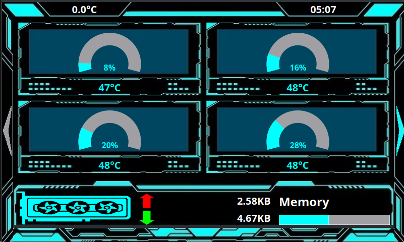
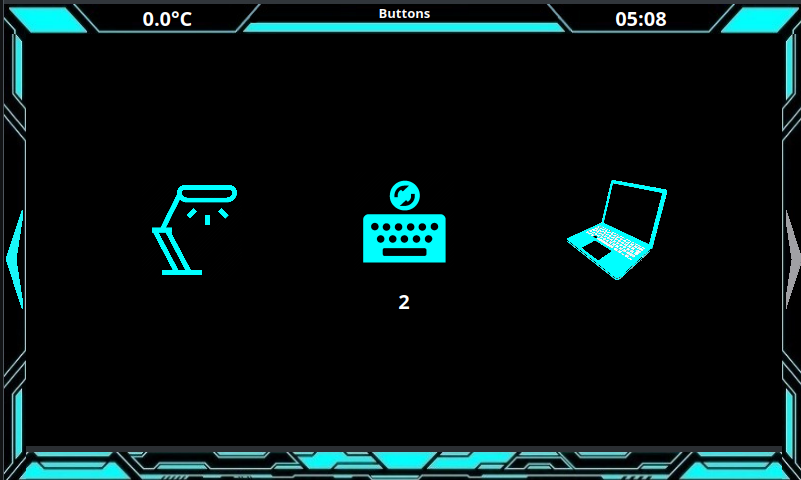

# Media-Display

A Client/Server based application to display metrics on a secondary device.

## Server

The server is a websocket server, wich displays the stats from connected clients. It also has standalone controls, for attached hatdware, like relays and temperature sensor.

## Client

The client sends collected stats to the server. To collect metrics OpenHardwareMonitor is used on Windows. On Unix psutil and gputil is used.
